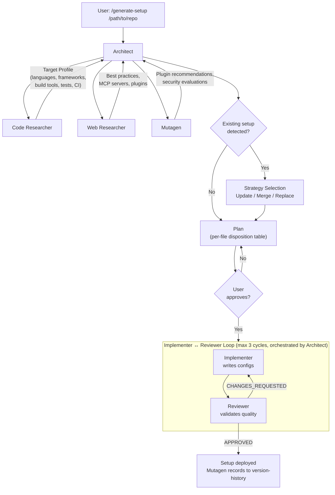
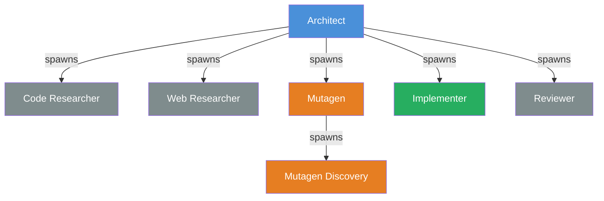
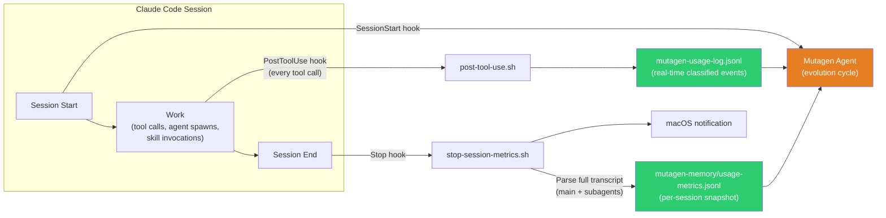
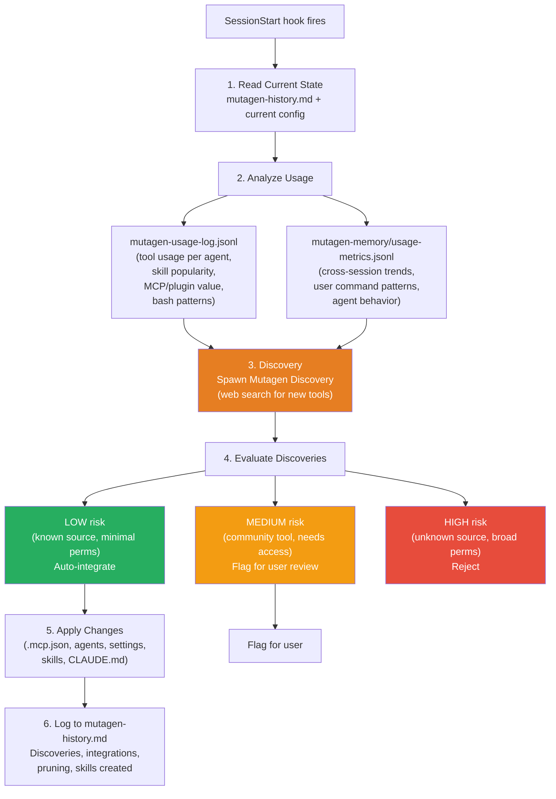

# CCAutomated

Generate optimal Claude Code setups for any repository — automatically.

CCAutomated analyzes a target repo's stack, structure, and tooling, then generates a complete Claude Code configuration tailored to it. The generated setup includes agents, skills, hooks, rules, and a self-evolving Mutagen system that keeps improving itself across sessions.

## Quick Start

**Prerequisites:** Claude Code CLI installed and authenticated.

```bash
# Open Claude Code in the CCAutomated directory
cd /path/to/CCAutomated
claude

# Generate a setup for any repo
/generate-setup /path/to/your/repo

# Preview what would be generated (no writes)
/dry-run /path/to/your/repo

# Search for plugins/MCP servers for a stack
/search-plugins typescript react next.js
```

The generated `.claude/` setup is fully gitignored on target repos — it's personal, local tooling.

## How It Works

A single `/generate-setup` command triggers a multi-agent pipeline that researches, plans, implements, and reviews the configuration.



### What each agent does

| Agent | Role | Read-only? |
|-------|------|:----------:|
| **Architect** | Orchestrates the full pipeline. Runs as main thread. Spawns all other agents. | No |
| **Code Researcher** | Analyzes target repo — languages, frameworks, build tools, tests, CI/CD, existing config. | Yes |
| **Web Researcher** | Searches web for best practices, MCP servers, plugins for the detected stack. | Yes |
| **Implementer** | Writes config files based on the Architect's plan. Supports per-file actions (CREATE/UPDATE/MERGE/REPLACE/KEEP). | No |
| **Reviewer** | Reviews generated configs for quality, correctness, security. Returns APPROVE or CHANGES_REQUESTED. | Yes |
| **Mutagen** | Evolution engine — discovers new tools, prunes unused ones, creates skills from patterns. | No |
| **Mutagen Discovery** | Web scout spawned by Mutagen to find new plugins/MCP servers/skills. | Yes |



> **Spawning rule:** The Architect is the only agent that spawns others. The one exception: Mutagen can spawn Mutagen Discovery. No agent spawns sub-subagents.

## Strategy Selection

When the target repo already has a `.claude/` setup, the Architect detects it and presents three strategies:

| Strategy | Behavior | When to use |
|----------|----------|-------------|
| **Update** (default) | Surgical edits only. Adds missing pieces, updates stale configs. Never removes user customizations. | Most cases — least invasive. |
| **Merge** | Generates the ideal config, then merges with existing. User content wins on conflicts. | When you want the latest recommendations but want to keep your tweaks. |
| **Replace** | Full overwrite. Backs up existing config to a git branch first. | Fresh start. Nuclear option. |

Every plan includes a per-file disposition table:

```
File                          Action   Rationale
CLAUDE.md                     MERGE    Exists — add missing sections, preserve user content
.claude/settings.json         UPDATE   Add new hooks, keep existing permissions
.claude/agents/mutagen.md     CREATE   Not present
.claude/hooks/post-tool-use.sh CREATE  Not present
.claude/agents/reviewer.md    KEEP     Already matches best practices
```

## Hooks & Tracking Pipeline

Three hooks form the observability backbone. They capture what happens during every Claude Code session and feed data to Mutagen for analysis.



### PostToolUse hook: `post-tool-use.sh`

Fires on every tool call. Classifies the event and appends one JSONL line. Must be fast (< 50ms).

Five event types:

| Type | Example `tool_name` | What's captured |
|------|-------------------|-----------------|
| `builtin` | `Read`, `Write`, `Grep` | Tool name, agent |
| `skill` | `Skill` | Skill name, args, agent |
| `mcp` | `mcp__context7__resolve-library-id` | Server name, tool name, agent |
| `bash` | `Bash` | Base command (first word), full command, agent |
| `agent` | `Agent` | Subagent type, description, agent |

Every event includes `agent` field — `"main"` for the main thread, or the subagent type (e.g., `"reviewer"`, `"code-researcher"`) for subagent calls. All events include a `ts` (ISO-8601 timestamp) field.

### Stop hook: `stop-session-metrics.sh`

Fires after each Claude response via the Stop hook. Parses the full session transcript (main thread + all subagent transcripts) and produces a comprehensive session snapshot. Deduplication ensures only the latest snapshot per session survives:

- Tool usage per agent and combined totals
- Skills invoked (programmatic via Skill tool)
- User slash commands (captured from transcript — these bypass PostToolUse)
- MCP tool usage
- Bash command frequency
- Per-subagent tool breakdowns
- Session duration

### SessionStart hook

Triggers the Mutagen agent to run its evolution cycle at the beginning of every interactive session.

## Mutagen: The Evolution Engine

Each target repo gets a full Mutagen agent. It runs on every session start and keeps the Claude Code setup at peak efficiency — discovering new tools, pruning unused ones, and creating skills from recurring patterns.



### What Mutagen tracks

| Data Source | What's in it | How Mutagen uses it |
|-------------|-------------|---------------------|
| `mutagen-usage-log.jsonl` | Every tool call, classified by type + agent | Raw data for usage analysis — combined with session metrics to identify unused tools (prune after 5+ sessions) and recurring bash patterns (create skills) |
| `mutagen-memory/usage-metrics.jsonl` | Per-session snapshots with combined totals | Cross-session trends, user command patterns, agent behavior analysis |
| `mutagen-memory/plugin-registry.md` | Every tool evaluated — name, source, risk, status | Skip re-evaluating known tools, track what was approved/rejected |
| `mutagen-memory/improvement-log.md` | Every decision Mutagen made — what, why, impact | Audit trail of all changes to the setup |
| `mutagen-history.md` | Evolution cycle summaries | High-level log of what happened each cycle |

### Skill creation from patterns

Mutagen detects recurring workflows and creates skills automatically:

- **Recurring bash commands** (3+ occurrences across sessions) → wrap in a skill
- **User slash command patterns** → the workflow is valuable, formalize it
- **Stack features without skills** (e.g., test framework present but no `/test`) → create missing skill
- **Community patterns** from Mutagen Discovery → propose skill

## What Gets Generated

On a target repo, `/generate-setup` produces:

```
your-repo/
├── .claude/
│   ├── agents/
│   │   ├── mutagen.md              # Evolution engine (runs on SessionStart)
│   │   ├── mutagen-discovery.md    # Web scout (spawned by Mutagen)
│   │   ├── researcher.md           # Codebase analyst
│   │   ├── implementer.md          # Code writer
│   │   └── reviewer.md             # Quality gate
│   ├── hooks/
│   │   ├── post-tool-use.sh        # Real-time usage logger
│   │   └── stop-session-metrics.sh # Session metrics aggregator
│   ├── mutagen-memory/
│   │   ├── plugin-registry.md      # Evaluated tools for this repo
│   │   └── improvement-log.md      # Mutagen's decisions for this repo
│   ├── skills/                     # Stack-specific commands
│   ├── rules/                      # Coding conventions
│   └── settings.json               # Permissions, hooks, model config
├── CLAUDE.md                       # Project instructions
└── .gitignore                      # Updated to exclude .claude/, CLAUDE.md, .mcp.json
```

## Supported Stacks

Templates included for:

| Stack | Frameworks | Recommended Skills |
|-------|------------|-------------------|
| **TypeScript/Node.js** | Next.js, React, Express, Fastify, NestJS | `/test`, `/typecheck`, `/lint-fix` |
| **Python** | Django, FastAPI, Flask | `/test`, `/typecheck`, `/lint-fix` |
| **Rust** | Cargo-based projects | `/test`, `/clippy`, `/build` |
| **Go** | Standard Go projects | `/test`, `/lint`, `/build` |
| **Monorepo** | Nx, Turbo, pnpm workspaces | Per-package skills |

Templates are starting points — every generated config is customized based on the actual repo analysis.

## Testing

Two test suites validate the full pipeline:

```bash
# Create a test repo (TypeScript/Express/Vitest project at /tmp/)
bash tests/setup-test-repo.sh

# Deploy a setup to it, then validate (33 checks)
bash tests/validate-setup.sh /tmp/ccautomated-test-repo

# Integration test: starts a real Claude session, verifies hooks fire
bash tests/integration-session-start.sh /tmp/ccautomated-test-repo
```

### validate-setup.sh (33 checks)

| Category | What's validated |
|----------|-----------------|
| **Structural** | `.claude/` exists, `CLAUDE.md` non-empty, JSON files valid, `.gitignore` correct |
| **Mutagen Pipeline** | Hook scripts exist and executable, use `jq` (not template vars), classify all 5 event types, settings.json wiring correct, agent references correct |
| **Agent Quality** | All agents use `model: opus`, Mutagen has Agent tool, no `bypassPermissions` |
| **Functional** | Mock JSON piped through hooks produces valid JSONL, all event types classified correctly, subagent attribution works |

### integration-session-start.sh

Starts a real `claude -p` session in the test repo and verifies:
- Session runs successfully
- Stop hook fires and produces valid session metrics
- PostToolUse hook creates usage log (when tools are used)

Note: SessionStart agent hooks may not fire in non-interactive (`-p`) mode — this is expected and reported as a warning, not a failure.

`validate-setup.sh` and `integration-session-start.sh` automatically clean up the test repo after running. Set `KEEP_REPO=1` to preserve for debugging. Use `cleanup-test-repo.sh` for manual cleanup.

## Architecture

```
CCAutomated/
├── .claude/
│   ├── agents/              # 7 agents powering the pipeline
│   │   ├── architect.md         # Entry-point orchestrator
│   │   ├── code-researcher.md   # Target repo analyzer
│   │   ├── web-researcher.md    # Web search for best practices
│   │   ├── implementer.md       # Config writer
│   │   ├── reviewer.md          # Quality validator
│   │   ├── mutagen.md           # Evolution engine
│   │   └── mutagen-discovery.md # Plugin/MCP server scout
│   ├── skills/              # 4 skills (3 user-invocable)
│   │   ├── generate-setup/      # Main entry point
│   │   ├── dry-run/             # Preview mode
│   │   ├── search-plugins/      # Plugin discovery
│   │   └── review-config/       # Quality checklist (internal)
│   ├── hooks/
│   │   └── stop-metrics.sh      # CCAutomated's own session metrics
│   ├── mutagen-memory/       # CCAutomated's own Mutagen memory
│   │   ├── version-history.md   # All generated setups
│   │   ├── plugin-registry.md   # Evaluated tools + risk levels
│   │   ├── improvement-log.md   # Mutagen's self-improvement decisions
│   │   ├── user-feedback.md     # Post-generation feedback
│   │   └── usage-metrics.jsonl  # Session data (gitignored)
│   └── rules/               # Agent conventions, quality, security
├── templates/               # Customized per target repo
│   ├── base/                    # CLAUDE.md, settings.json, hooks, gitignore
│   ├── stacks/                  # TypeScript, Python, Rust, Go, Monorepo
│   └── agents/                  # Target repo agent definitions
└── tests/                   # Validation + integration tests
    ├── setup-test-repo.sh
    ├── validate-setup.sh        # 33-check validation suite
    ├── integration-session-start.sh
    └── cleanup-test-repo.sh
```
